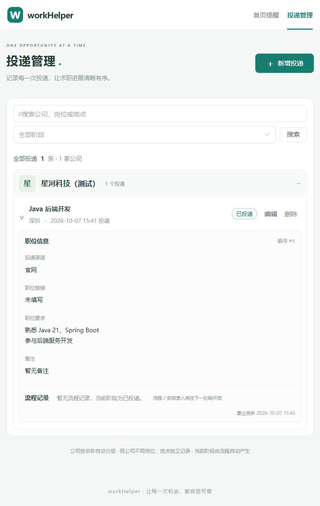

## 阶段五增补验收（2026-10-08）

- 已完成顶部辅助“备份与恢复”弹窗：下载完整 JSON、选文件校验、恢复前后数量比较、输入确认词后全量恢复、恢复前自动备份列表及下载；两个主导航不变。
- 格式版本 1 覆盖所有业务表及关系，不含连接密码。严格校验类型、版本、时区、必填字段、长度、编号、归属、时间及排序；最大 32 MB。空备份有清空提示。
- V4 新增数据库协调行，所有业务修改、备份和恢复统一锁定；校验返回修订号与文件摘要，数据或文件变化后拒绝旧预览。替换采用单事务 DELETE/INSERT，保留 ID/时间并重算派生字段，不用 TRUNCATE。
- 覆盖前先将完整原数据写入 `backups/` 并落盘，写入失败则不替换；数据库回滚时文件保留。自动备份不随 Maven clean 删除，目录已加入 Git 忽略。
- `mvnw.cmd package`：28 项 HTTP 集成测试全部通过，包含新增 8 项备份还原、自动备份还原、坏文件/错误关联/排序/时间、预览失效、确认检查、写盘失败、写入后故障回滚、并发恢复及空备份/文件大小/文件名限制。前端 TypeScript 和 Vite 构建通过。
- 真实 MySQL 8.0.31：旧版 V3 建投递、面试和多行问答，再用新版脚本升级至 V4，旧内容完整；浏览器将 2 条投递恢复成备份中的 1 条，流程与 2 条问答保留，恢复前 2 条投递的自动备份实际下载到本地。
- 真实回滚：仅在专用临时库创建问答插入失败触发器，使恢复在投递/流程已写入后失败；HTTP 返回 503，三张业务表逐项与操作前一致，自动备份保留；测试后删除触发器。
- 运行交付：隔离副本验证首次启动就绪、重复启动识别、非法端口、其他程序占用端口、错误数据库账号；构建提前检查 JAR 文件锁。重启后恢复数据、回滚结果及两份自动备份均保留，迁移不重复执行。
- 浏览器校验文件选择、数量预览、确认词门槛、恢复成功、自动刷新和自动备份下载。390 像素窄窗口下备份弹窗、主导航及首页主要操作可用，无横向溢出；验收后恢复默认浏览器尺寸。
- 全程使用专用临时库与生成目录内的配置副本，不修改用户 YAML 和业务数据库。运行文档已补齐备份恢复、换机运行、更新顺序与常见问题。
- 验收后已停止测试服务，删除专用临时库、测试运行副本、旧版测试 JAR 和测试下载文件。新版 `target/workHelper.jar` 与 `target/phase-five-preview.png` 保留，MySQL 继续运行，测试端口不再监听。
- 当前边界：个人本机使用；不提供自动定时备份、云同步或系统通知。文件上限与时区要求见 README。

---

## 阶段四增补验收（2026-10-08）

- 已完成：面经详情、整体总结、问答增删改和上下排序；面试流程显示记录/查看面经入口，不增加主导航。
- 弹窗编辑后统一保存整轮草稿；问题必填，空回答/复盘可保存，保留中文长文本和换行；未保存离开提示、失败保留输入。
- V3 增加总结、编辑版本、问答计数与问答表。保存使用事务及父记录锁，校验问答归属和重复 ID，旧版本返回 409；已有面经时禁止改成非面试阶段，防止内容失去入口。
- `mvnw.cmd test`：20 项 HTTP 集成测试全部通过；新增 5 项覆盖空面经、长文本、空回答、排序与 ID/创建时间保留、清空删除、输入校验、跨岗位/轮次隔离、旧版本冲突、阶段修改保护及级联删除。
- TypeScript/Vite 构建和 Maven 打包通过。Vite 仍提示既有 Element Plus 整包体积较大，不影响本地运行。
- 真实 MySQL 8.0.31：先用旧 JAR 创建 V2 数据库及中文投递/面试，再启动新版自动执行 V3；原数据、阶段与备注保留。
- 浏览器：验证空状态、弹窗必填提示、总结/问答多行录入、仅问题录入、上下排序、刷新后内容持久化、编辑回填与保存、未保存离开提示、返回定位及“查看面经”入口；API 再核对实际 MySQL 内容及顺序。
- 截图保存在 Git 忽略的 `target/phase-four-preview.png`；运行配置未改动，不新增配置目录。
- 真实 MySQL 验证问答删除及投递级联删除后，流程和问答计数均为零。测试使用专用临时库，未写入业务库。
- 验收结束后停止测试服务、删除临时数据库与旧版测试 JAR；新版 `target/workHelper.jar` 保留，MySQL 服务继续运行。打包前已停止占用 JAR 的旧版 8080 应用，使用 `start.bat` 启动新版。
- 后续范围：备份恢复及交付验收。

---

## 阶段三增补验收（2026-10-07）

- 已完成：首页近三天提醒、全部待办、已完成、逾期独立分组、时间排序与今天/明天/后天标识；支持完成、编辑改期及跳转定位流程。
- 提醒与投递共用流程数据，无新增数据库表；已取消和仅记录阶段不进入提醒。近三天按业务时区的自然日计算，跨日进行中的安排保留。
- `mvnw.cmd test`：15 项 HTTP 集成测试通过，覆盖自然日窗口、逾期边界、跨日安排、状态与改期同步、删除和业务时区跨零点。
- 前端 TypeScript 检查、Vite 生产构建及 Maven 打包通过；默认入口和启动脚本已切换首页。
- 真实 MySQL 8.0.31 临时库验证三个视图的数量、排序及排除规则。浏览器验证完成后移入历史、改期后移出近期但保留全部待办，以及公司/岗位自动展开、目标流程聚焦高亮。
- 页面可见时每 30 秒、重新获得焦点及业务日期跨零点刷新；跨零点业务筛选使用固定时钟测试验证，未等待真实午夜验收。
- 验收截图仅保存在 Git 忽略的 `target/phase-three-preview.png`，复用本文件记录验收，保留历史记录。
- 测试服务已停止、专用临时数据库已删除，业务数据库未改写，MySQL 服务保留运行。
- 后续范围：面经问答、备份恢复。

---

## 阶段二增补验收（2026-10-07）

- 已完成：流程增删改查、定时/截止/仅记录阶段三种方式、完成/取消/恢复待完成、改期、当前阶段自动计算。
- `mvnw.cmd test`：9 项 HTTP 集成测试全部通过，包含阶段回退、结果时间排序、非法时间不写入、归属隔离、级联删除和并发创建后的阶段一致性。
- `npm run build`：TypeScript 检查与生产构建通过；`mvnw.cmd package -DskipTests` 已在测试通过后产出新版 JAR。
- MySQL 8.0.31：使用专用临时库，先运行 V1 并写入旧投递，再升级 V2；旧投递保留，V1/V2 迁移均成功。验证二面与补录、取消保留阶段、结果优先级、删除结果后回退以及投递级联删除（无孤立流程）。
- 浏览器：检查岗位展开、新增流程、必填时间提示、保存后阶段更新、完成不新增阶段、编辑回填与改期保存；中文、多行备注与三类时间方式展示正常。
- 清理：删除可再生的本地 npm 缓存、旧静态构建副本及增量缓存；移除未使用的 Lombok 和冗余注解处理器配置。历史文档和截图保留供追溯，新验收截图仅放在被 Git 忽略的 target 目录。
- 测试使用临时数据库，不改写业务库。测试结束后停止测试进程并删除临时库，MySQL 服务保留。
- 后续范围：首页待办汇总、面经问答、备份恢复。当前页面仅展示已有流程，未预创建空面试轮次。

---

更新说明：按用户最新要求，运行配置已统一到 src/main/resources/application.yml，config 目录已删除。以下为阶段一完成时的历史验收记录，其中外部配置描述不再适用。

# 基础与投递管理：验收记录

日期：2026-10-07（Asia/Shanghai）。范围以本次请求为准：工程基础、MySQL、Vue、投递 CRUD、公司和岗位展开。不含流程安排、首页提醒业务、面经和备份恢复。

## 已通过

| 检查 | 结果 |
| --- | --- |
| Java 21 + Spring Boot 4.1.1 编译 | 通过 |
| Maven Wrapper | 修复 PowerShell 对空 Target 数组取下标的问题；`mvnw.cmd test` 通过 |
| HTTP 集成测试 | 4 个用例，0 失败、0 错误；H2 隔离数据库 |
| Vue / TypeScript / Vite 生产构建 | 通过，产物已进入 `target/workHelper.jar` |
| 实际 MySQL 8.0.31 | 独立进程、仅监听 127.0.0.1:13306，专用 `work_helper_smoke` 数据库 |
| Flyway 真实迁移 | V1 成功，迁移历史 success=1；重启没有重复迁移 |
| 真实 MySQL CRUD | 新增中文及多行内容、编辑地点、文字搜索、删除并验证其他投递保留 |
| 重启持久化 | 停止并重启 Java、MySQL 后，已有记录和编辑结果保留 |
| 时区 | JVM 改为 UTC 后，上海业务时间和已保存投递时间保持不变 |
| 数据库中断 | 停止隔离 MySQL 后 API 返回 503 和中文连接错误，不暴露数据库内部信息 |
| 启动脚本 | Windows PowerShell 运行隔离配置、健康检查就绪、重复运行识别现有服务、端口冲突明确报错 |
| 浏览器操作 | 新增弹窗、必填校验、新增保存、编辑回填与保存、公司折叠/展开、岗位展开、重载后数据展示 |
| 本地敏感配置 | `config/application.properties` 已被 Git 忽略；依赖缓存、构建文件也已忽略 |

HTTP 集成测试覆盖同公司同岗位不同地点的独立记录、首尾空格规范化、多行文本、保留投递时间、字面量 `%` / `_` 搜索、阶段只读、无效阶段、无效日期/链接、超长输入、404、健康检查和业务时区。

## 修复的实际问题

- Maven Wrapper 对普通 `.m2` 目录的空符号链接 Target 取下标导致无法启动，已先检查 Target 是否存在。
- 新安装 MySQL 无命名时区表时，强制设置会话 `Asia/Shanghai` 会连接失败。已取消强制会话时区，DATETIME 通过 JDBC LocalDateTime 读写，避免依赖服务器时区表和 JVM 默认时区。
- 自动测试显式指定 H2 连接，不允许本地外部 MySQL 配置把测试重定向到业务库。

## 边界与待验收

- 用户日常 MySQL 的数据库及凭据尚未提供；实际配置文件当前是模板，需要填写后连接日常数据库。真实联调使用的是隔离测试实例，不能把它当成已配置好用户业务库。
- 脚本验证使用 `-NoBrowser`，没有实际双击验证默认浏览器自动打开或 Ctrl+C 交互；相关代码已提供。90 秒启动超时分支未做完整等待测试。
- 浏览器检查使用约 700px 窄窗口；更广泛的浏览器和尺寸验收留待交付阶段。
- 前端构建有 Element Plus 全量包大于 500kB 的提示；当前本地应用可运行，可在后续按需引入组件优化。
- 未实现流程安排和关联问答，当前阶段固定自动显示“已投递”。关联删除需在后续建表时实现。
- `target/mysql-smoke` 与 `target/startup-smoke` 是临时测试产物，测试进程已停止；日常数据库不应放在 target 中。

## 页面截图

以下为隔离测试数据，不会进入用户日常数据库。

